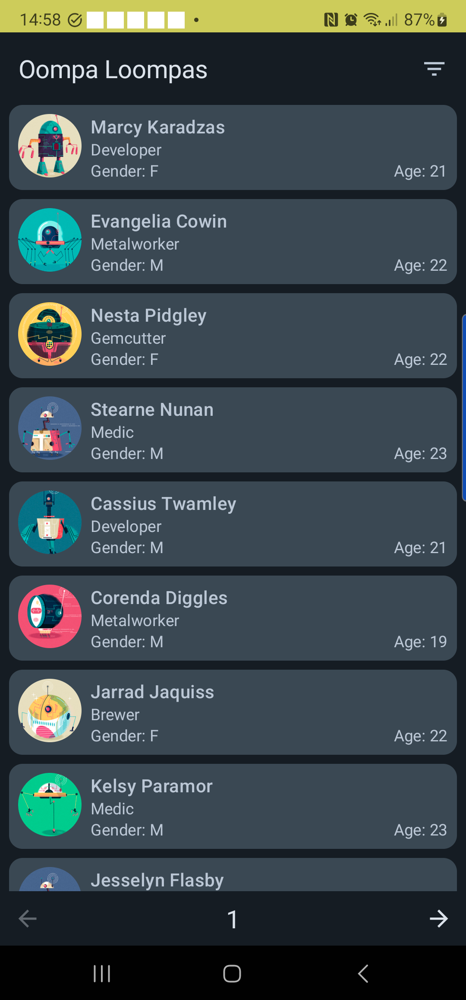
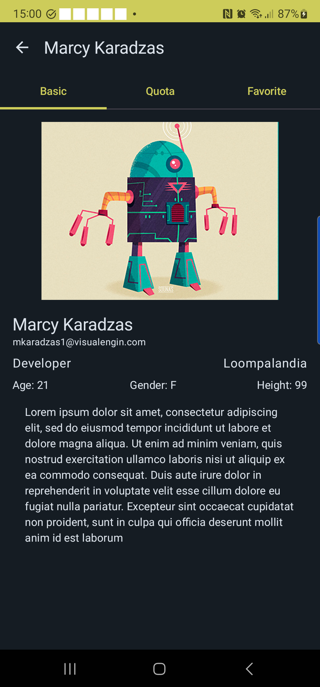
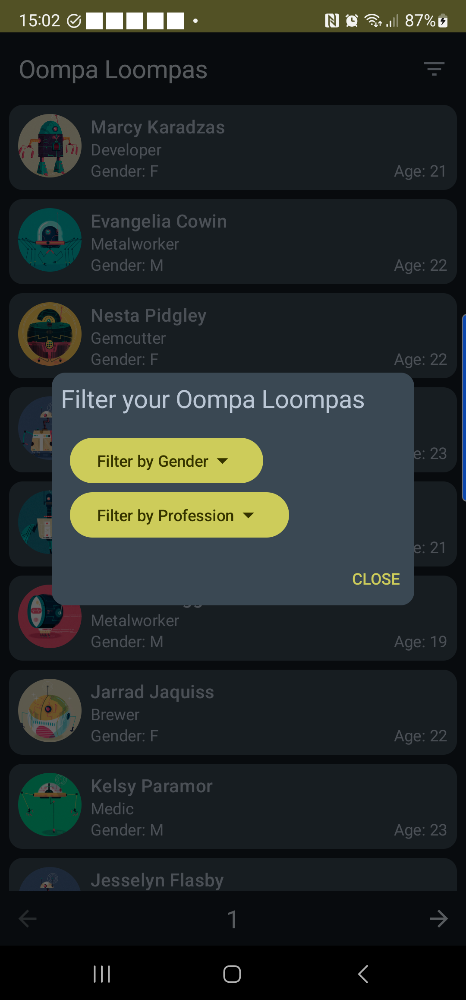
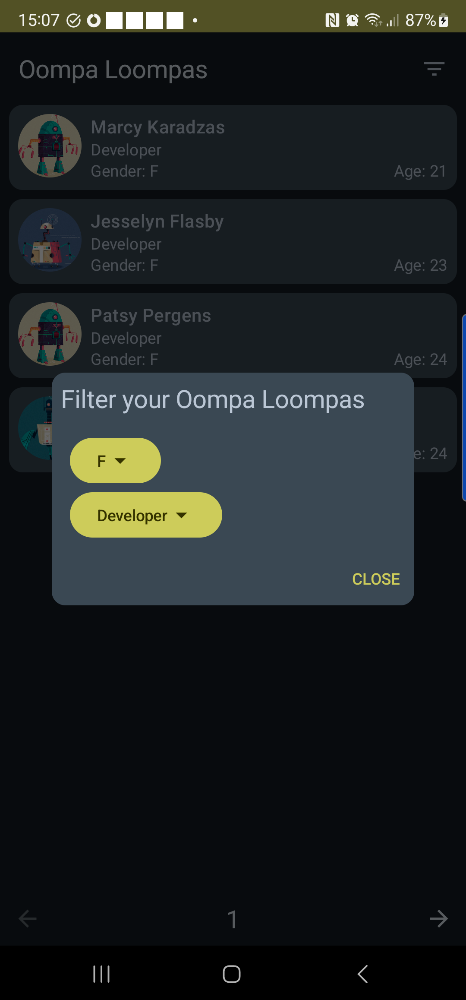

    

# oompa-loompas-app

Android native app to help with the management of Oompa Loompas

## Features

### Retrieve Oompa Loompas data from a REST endpoint

This simple app lists the Oompa Loompas received from the
endpoint https://2q2woep105.execute-api.eu-west-1.amazonaws.com/napptilus/oompa-loompas

This is done using Retrofit2 and Mochi and the data is cached locally.

When running the app in debug mode, Http requests are logged in to Logcat.

### Display the list of Oompa Loompas

The app makes use of the Jetpack Compose API and uses some Material3 experimental features.

### Display details of an Oompa Loompa

When clicking on an Oompa Loompa, the app displays the details of the Oompa Loompa in a new screen.

### Pagination

The app supports the pagination from the endpoint.

### Filter by gender and/or profession

The user can filter via a Dialog.

The filter is reset when the user navigates back to the list of Oompa Loompas and when a new page is
loaded.

### 3rd party libraries used in this project

- Hilt: Dependency injection
- Retrofit2: REST client
- Mochi: Parsing JSON
- Coil: Image async loading